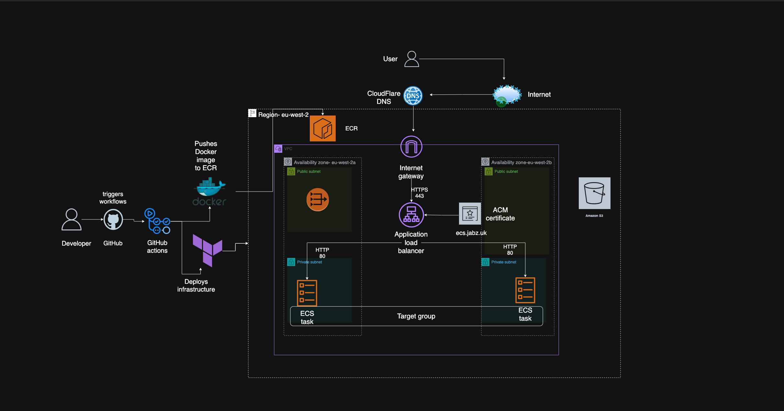
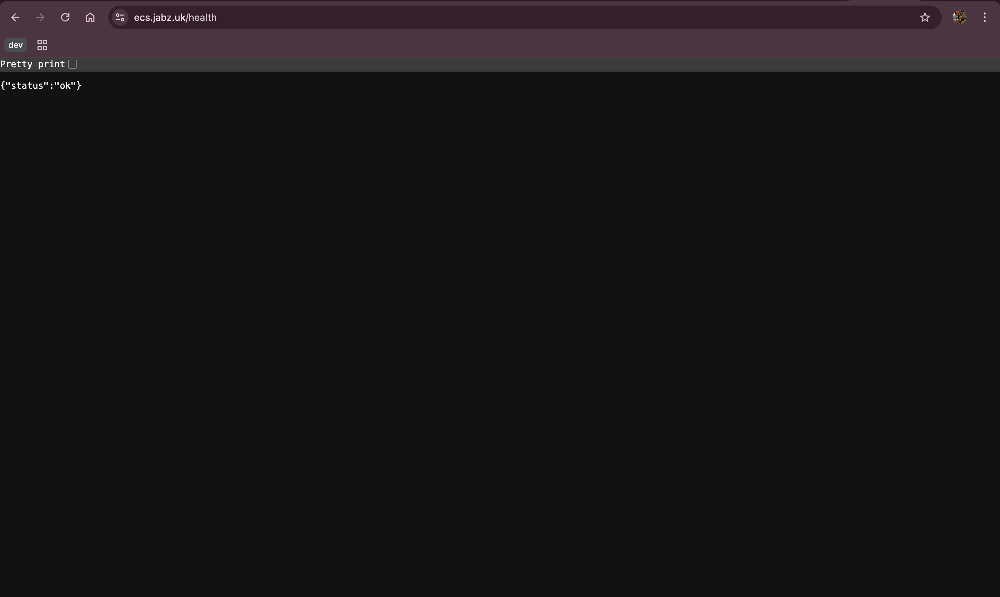
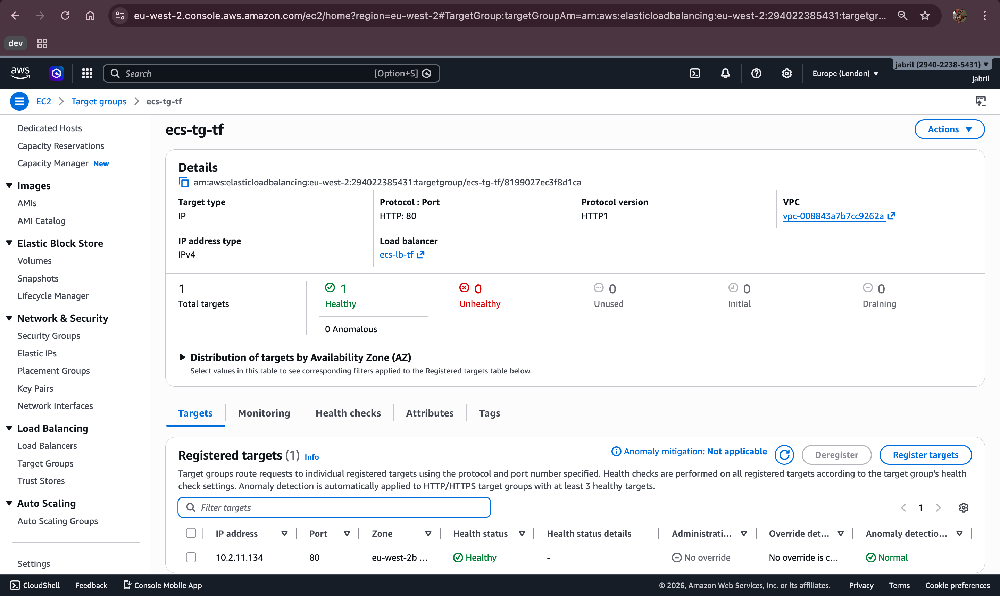
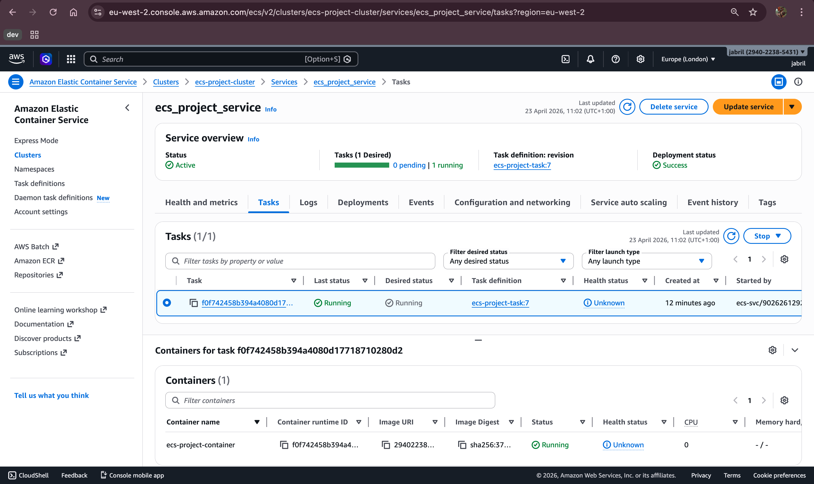

# End to End Production Grade Deployment on AWS ECS Fargate - [Go Application]

This project demonstrates a production-grade deployment of a Go application on AWS ECS Fargate, with all infrastructure provisioned using Terraform and a fully automated CI/CD pipeline using GitHub Actions.

The setup follows real DevOps practices: modular infrastructure as code, private networking, secure image delivery, HTTPS termination, automated security scanning, and remote state management.

---

## Live Deployment


https://github.com/user-attachments/assets/cb0cf9c0-44cb-482d-a581-23ddc3b4bf29


---

## Architecture Overview



The architecture is designed for security and high availability:

- Multi-AZ VPC with public and private subnets
- Internet-facing Application Load Balancer with HTTPS
- ECS Fargate tasks running in private subnets
- Outbound internet access via NAT Gateway
- TLS certificates issued by ACM, DNS-validated via Cloudflare
- Container images stored in private Amazon ECR
- Fully automated CI/CD pipeline with security scanning

---

## Deployment Verification





---

## Repository Structure
```
ecs-project
├── Dockerfile
├── README.md
├── app
│   └── main.go
├── assets
│   ├── Docker-image-pushed-to-ECR.png
│   ├── Docker-running.png
│   ├── alb-health-check.png
│   └── live-domain-https.png
├── go.mod
└── infra
    ├── backend.tf
    ├── main.tf
    ├── modules
    │   ├── acm
    │   │   ├── main.tf
    │   │   ├── outputs.tf
    │   │   └── variables.tf
    │   ├── alb
    │   │   ├── main.tf
    │   │   ├── outputs.tf
    │   │   └── variables.tf
    │   ├── ecr
    │   │   ├── main.tf
    │   │   ├── outputs.tf
    │   │   └── variables.tf
    │   ├── ecs
    │   │   ├── main.tf
    │   │   ├── outputs.tf
    │   │   └── variables.tf
    │   ├── iam
    │   │   ├── main.tf
    │   │   ├── outputs.tf
    │   │   └── variables.tf
    │   └── vpc
    │       ├── main.tf
    │       ├── outputs.tf
    │       └── variables.tf
    ├── outputs.tf
    ├── provider.tf
    ├── terraform.tfvars
    └── variables.tf
```

---

## Infrastructure Components

**Networking**
- Custom VPC spanning 2 Availability Zones
- Public subnets for ALB and NAT Gateway
- Private subnets for ECS tasks
- Route tables and security groups scoped by responsibility

**Compute and Containers**
- Amazon ECS Fargate for serverless container execution
- Private ECR repository for container images
- Task definitions updated automatically per deployment

**Load Balancing and TLS**
- Application Load Balancer handling all inbound traffic
- HTTP to HTTPS redirect
- ACM-managed TLS certificate
- DNS validation handled via Cloudflare

**State Management**
- Remote Terraform state stored in Amazon S3
- Native state locking enabled
- Safe concurrent execution in CI/CD

---

## CI/CD Pipelines

The project uses 4 GitHub Actions workflows:

**1. Docker Build and Push**
Triggers on push to main when app code changes. Builds the image, tags with commit SHA, runs Trivy security scan, pushes to ECR.


**2. Terraform Plan**
Manual trigger. Runs terraform validate and plan to preview changes before applying.


**3. Terraform Deploy**
Manual trigger. Applies all infrastructure changes.


**4. Terraform Destroy**
Manual trigger only. Destroys all infrastructure safely.


Authentication to AWS is handled using GitHub OIDC, eliminating long-lived AWS credentials.

---

## Run Locally

**Prerequisites:** Go 1.26+, Docker

```bash
git clone https://github.com/aceJabril/ECS-Project
cd ECS-Project

# Run with Go
go run app/main.go
curl http://localhost:80/health

# Run with Docker
docker build -t ecs-project .
docker run -p 80:80 ecs-project
curl http://localhost:80/health
```

---

## Security Considerations

- No secrets committed to version control
- Private subnets for ECS workloads
- IAM roles scoped to least privilege
- HTTPS enforced end-to-end
- Automated container scanning with Trivy
- OIDC authentication — no long-lived AWS credentials

---

## Tech Stack

**Infrastructure and Cloud**
- AWS: VPC, ECS Fargate, ECR, ALB, ACM, S3
- Cloudflare: DNS and ACM validation
- Terraform: Modular infrastructure as code

**CI/CD and Security**
- GitHub Actions
- OIDC for AWS authentication
- Trivy for container scanning

**Application**
- Go
- Docker

---

## Reproducing This Setup

1. Clone the repo
2. Create an S3 bucket for Terraform state and update `backend.tf`
3. Set up OIDC between GitHub and AWS
4. Create an IAM role scoped to your repo
5. Add GitHub secrets — `AWS_ROLE_ARN` and all `TF_VAR_*` values
6. Run Terraform Deploy pipeline
7. Add CNAME record in Cloudflare pointing to ALB DNS name
8. Add ACM validation CNAME in Cloudflare
9. Verify `https://yourdomain/health`
